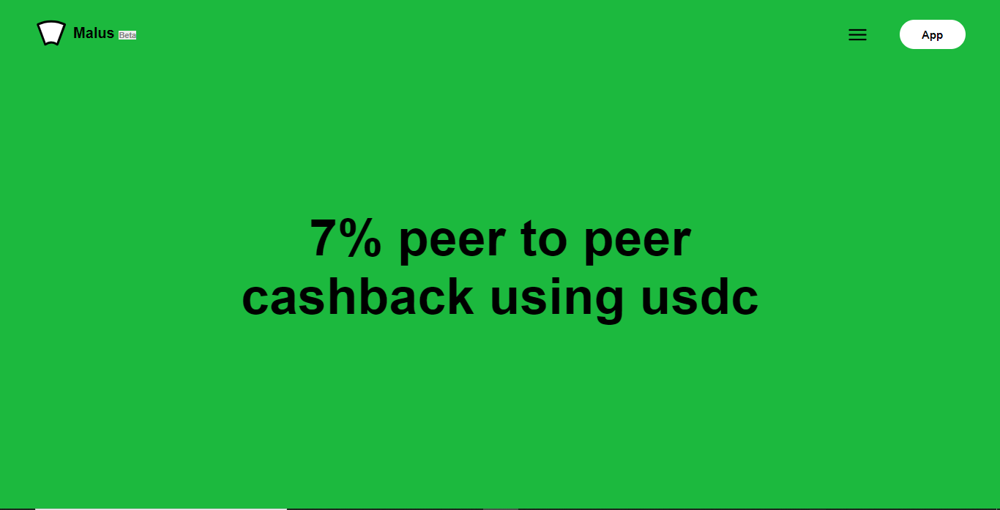

# Malus-Frontage

This repo is for the Malus [website](https://malus.fi) frontpage. It is built using React.js and it is an introductory page to the to the application.

## Frontpage-Image

### `npm start`

Runs the app in the development mode.\
Open [http://localhost:3000](http://localhost:3000) to view it in the browser.

The page will reload if you make edits.\
You will also see any lint errors in the console.
